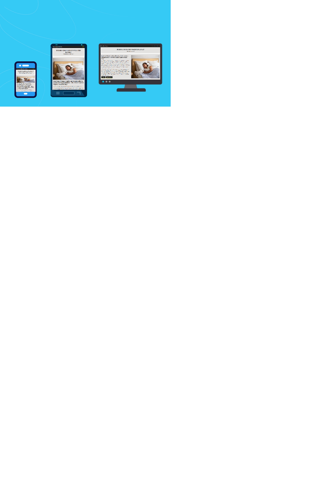

# Heavy Sleep Blankets

## Code Institute Milestone Project 1 – Static Front End Project

<h2 align="left"></h2>

## Live Project

[You can view the live project here.](https://ruddockc.github.io/heavy-sleep-blankets/)

## GitHub Repository

[You can find the project repository here.](https://github.com/Ruddockc/heavy-sleep-blankets)

# Contents

- [User Experience](#user-experience)  

  * [User Stories](#user-stories)  

    + [Prospective customers](#prospective-customers)  

    + [Returning customers](#returning-customers)

# User Experience  

## User Stories  

### Prospective Customers 

*The website users that fall into this category are considering purchasing a weighted blanket.*  

* As a user, I want to visit the website and see a visually appealing "Coming Soon" page for weighted blankets, so I can learn more about the upcoming product.  

*  As a user, I want to have the option to join a mailing list to be alerted when the weighted blankets are available for purchase.  

* As a user, I want to find information about the benefits of weighted blankets and why I should consider buying one, so I can make an informed decision.   

* As a prospective tenant, I would like to be able to contact the owners if I have any questions or special requests.  

### Returning Customer  

*The website users that fall into this category are people that are returning to the website for an update*  

* As a returning user, I want to see if there are any updates or changes to the launch date, so I can plan accordingly.  

* As a returning user, I want to easily access the newsletter signup or notification options in case I missed them during my initial visit.