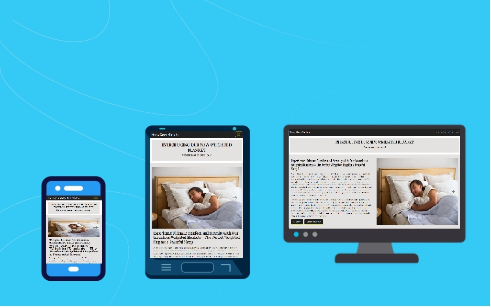

# Heavy Sleep Blankets

## Code Institute Milestone Project 1 – Static Front End Project

<h2 align="left"></h2>

## Live Project

[You can view the live project here.](https://ruddockc.github.io/heavy-sleep-blankets/)

## GitHub Repository

[You can find the project repository here.](https://github.com/Ruddockc/heavy-sleep-blankets)

# Contents

- [User Experience](#user-experience)  

  * [User Stories](#user-stories)  

    + [Prospective customers](#prospective-customers)  

    + [Returning customers](#returning-customers)

- [Design](#design)  

  + [Colour scheme](#colour-scheme)  

  + [Typography](#typography)  

  + [Imagery](#imagery)  

  + [Icons](#icons)  

- [Structure](#structure)  

  + [Information Architecture](#information-architecture)  

  + [Navigation Bar](#navigation-bar)  

  + [Back To Top Button](#back-to-top-button)  

  + [Buttons](#buttons)  

  + [Page Heading & Sub Navigations](#page-heading-and-sub-navigations)  

  + [Footer](#footer)  

- [Wireframes](#wireframes)

- [Features](#features)

  + [Current Features](#current-features)

- [Technologies Used](#technologies-used)

  + [Languages Used](#languages-used)

  + [Frameworks Libraries and Programs](#frameworks-libraries-and-programs)

- [Testing](#testing)

- [Deployment](#deployment)

- [Credits](#credits)

  + [Code](#code)

  + [Acknowledgements](#acknowledgements)

# User Experience  

## User Stories  

### Prospective Customers 

*The website users that fall into this category are considering purchasing a weighted blanket.*  

* As a user, I want to visit the website and see a visually appealing "Coming Soon" page for weighted blankets, so I can learn more about the upcoming product.  

*  As a user, I want to have the option to join a mailing list to be alerted when the weighted blankets are available for purchase.  

* As a user, I want to find information about the benefits of weighted blankets and why I should consider buying one, so I can make an informed decision.   

### Returning Customers  

*The website users that fall into this category are people that are returning to the website for an update*  

* As a returning user, I want to see if there are any updates or changes to the launch date, so I can plan accordingly.  

* As a returning user, I want to easily access the newsletter signup or notification options in case I missed them during my initial visit.

## Design  

### Colour Scheme  

#### Primary Colours
 - GREY #e4e2e0
 - BLACK #000000
 - WHITE #ffffff  

#### Secondary Colours
 - YELLOW #ffff00
 - OFF BLACK #212121   

  + The nav bar is black and yellow giving a nice contrast. The yellow has been used as a fade affect on the logo and nav bar along with every button.

  + The grey and black has been used on top of white to create a nice contrast on every page. 

### Typography  

- The whole website has a Playfair Display. Sans serif is the fallback font should Playfair Display be unavailable.

### Imagery  

- The images were taken from various websites which can be seen in the Frameworks Libraries and Programs section

### Icons  

- All icons were sourced from Font Awesome and have been used sparingly across each page to allow for a more focused approach to catch the users attention.

## Structure  

### Website Architecture  

- This website has a home page and a further 2 pages: Gallery and Submit Interest.  

  - Home page – This is the landing page with a hero image and descriptions of the benefits of the product and navigation to the other pages.  

  - Gallery - This page displays images of the product and details more benefits of the product.

  - Submit Interest - This page provides a contact form to allow users to submit their interest in the product or any other general queries they may have.

### Headings and sub headings 

  - Each page of the website contains a heading to consistently show the user what to expect on each page. 
 
  - All of the pages have subheadings to clearly demonstrate a separation of content that helps the user experience when navigating the content.

### Navigation Bar 

  - Each of the pages maintains the same navigation section which allows all users to easily navigate between the pages without having to use the browser or return to the homepage.  

  - The website utilises a collapsible navigation bar which shrinks as the screen size decreases until a hamburger icon is used to open and close the navigation menu.

  - The navigation bar was sourced from bootstrap documentation and has been customised using CSS to create a unique background, font and colour combination.

  - The active page is shown in a different colour to the rest of the navigation links and is underlined while active. A hover was also put in place which will fade in the alternative selections. 

  - Each page has a back to top of page button at the bottom of each page, just above the footer. This was implemented to improve user experience and reduce swipes and scrolls of screens.

### Buttons 

  - The buttons used across the pages are consistent throughout using the colour palletes of the primary and secondary colours as details above.  

  - The text on each of the buttons is followed by a greater than sign to guide the user to follow the link. 

  - The buttons use a hover class so when the user hovers over it, it changes colour. Both colour variants were assessed and determined to be legible. 

  - Bootstrap buttons were used and customised with CSS.

### Footer 

  - The footer is consistent on each page and contains the logo, address, telephone, email and social media links. 

  - The telephone and email links have been added and tel and mailto links. 

  - All links to external social media sites open in a new tab. 

  - The social media icons were source from font awesome.

### Wireframes 

- [You can view my wireframes in PDF form here.](https://github.com/Ruddockc/heavy-sleep-blankets/blob/main/assets/wireframes/heavy-sleep-blankets-wireframe.pdf)

# Features 
 
## Current Features 
 
### Responsive on all device sizes 

  - The development of this website was mobile first, therefore the website is fully responsive on all device screen sizes. 

  - I have used the Bootstrap grid concept and adjusted the layout according to the size of the devices screen size. In some cases this was facilitated by the use of CSS media queries.

### User interaction 

  - Image carousels on the home page feature forward and backward buttons which the user is able to control.

  - The navbar turns into a drop down (hamburger on smaller devices).

## Languages Used 
 
- [HTML5](https://en.wikipedia.org/wiki/HTML5) 
 
- [CSS3](https://en.wikipedia.org/wiki/CSS) 

## Frameworks Libraries and Programs 
 
- [Bootstrap 5.2](https://getbootstrap.com/)  
  - I used bootstrap throughout the site to make it responsive. The website uses Bootstrap's Containers, Grid System and Flexbox and Button classes. I sourced code from the Bootstrap documentation when building the Navbar, Carousel, Buttons and Contact Form,  
   
- [Google Fonts](https://fonts.google.com/) 
  - Two fonts were imported from google fonts. Aboreto for the headings, and Lato for the general text. 
   
- [Font awesome](https://fontawesome.com/) 
  - Icons were used from font awesome to add texture to some of the pages and styles.
 
- [Gitpod](https://gitpod.io/) 
  - Gitpod was used to create the folder structure and write the code and content. 

- [Git](https://git-scm.com/) 
  - Git was used for version control in the terminal. 
 
- [Github](https://github.com/) 
  - Github was used to create and store the project repository. 
  
- [jQuery](https://jquery.com/) 
  - jQuery is associated with the bootstrap cdn and assists in the navigation responsiveness. 
 
- [Miro](https://miro.com/) 
  - Miro was used to create Wireframes for the project. 

- [Adobe Illustrator](https://adobe.com/) 
  - Adobe Illustrator was used to amend the colours of the vector art used on the navbar and footer. 

- [Microsoft Paint](https://apps.microsoft.com/detail/paint/9PCFS5B6T72H?hl=en-gb&gl=GB)
  - Microsoft Paint was used to re-size some of the images used.

- [Various Sites used to source images]
  - Pexels was used to source images for the website which were not of the holiday cottage itself.
    - [Pexels](https://www.pexels.com/)
    - [istockphoto](https://www.istockphoto.com/)
    - [altamira](https://www.altamira.ai/)

- [TinyPNG](https://tinypng.com/) 
  - TinyPNG was used to compress images for a faster loading time. 
 
- [Microsoft Visual Studio Code](https://visualstudio.microsoft.com/) 
  - Microsoft Visual Studio Code was used to help beautify the code.

- [Google Chrome Dev Tools](https://developer.chrome.com/docs/devtools/) 
  - Google Chrome's Dev Tools were utilised during the build of the project to test functionality, responsiveness and for debugging purposes.

# Testing 

- For all testing documentation, please [click here](https://) for more information.

## Forking the GitHub Repository

Forks are used to propose changes to someone else's project or to use someone else's project as a starting point for your own idea. By forking the GitHub Repository you make a copy of the original repository on our GitHub account to view and/or make changes without affecting the original repository.

To Fork a Github Repository:

1. Log in to GitHub and navigate to the [GitHub Repository](https://github.com/Ruddockc/heavy-sleep-blankets/)
2. In the top-right corner of the page, click Fork.
3. Select an owner for the forked repository.
4. By default, forks are named the same as their parent repositories. You can change the name of the fork to distinguish it further.
5. Optionally, add a description of your fork.
6. Choose whether to copy only the default branch or all branches to the new fork. For many forking scenarios, such as contributing to open-source projects, you only need to copy the default branch. By default, only the default branch is copied.
7. Click Create fork.
8. You should now have a copy of the original repository in your GitHub account.

## Making a Local Clone

You will now have a fork of the repository, but you don't have the files in that repository locally on your computer.

To make a local clone:

1. Log in to GitHub and go to the [GitHub Repository](https://github.com/Ruddockc/heavy-sleep-blankets/)
2. Above the list of files, click  Code.
3. Copy the URL for the repository.
  - To clone the repository using HTTPS, under "Clone with HTTPS", click the 'Copy' icon. 
  - To clone the repository using an SSH key, including a certificate issued by your organization's SSH certificate authority, click Use SSH, then click the 'Copy' icon. 
  - To clone a repository using GitHub CLI, click Use GitHub CLI, then click the 'Copy' icon.
4. Open Git Bash.
5. Change the current working directory to the location where you want the cloned directory.
6. Type git clone, and then paste the URL you copied earlier. It will look like this, with your GitHub username instead of YOUR-USERNAME:

```
$ git clone https://github.com/YOUR-USERNAME/YOUR-REPOSITORY
```

7. Press Enter. Your local clone will be created.

```
$ git clone https://github.com/YOUR-USERNAME/YOUR-REPOSITORY
> Cloning into `XXXXXXXXXXX`...
> remote: Counting objects: 10, done.
> remote: Compressing objects: 100% (8/8), done.
> remove: Total 10 (delta 1), reused 10 (delta 1)
> Unpacking objects: 100% (10/10), done.
```

Click [here](https://docs.github.com/en/github-ae@latest/get-started/quickstart/fork-a-repo) for the GitHub quick start guide with images and more detailed explanations of the above process.

## GitHub Pages

The project was deployed to GitHub Pages using these steps:

1. Log in to GitHub and go to the [GitHub Repository](https://github.com/Ruddockc/heavy-sleep-blankets/)
2. Locate the Navbar at the top of the Repository (not top of page). Click the Settings tab.
3. Locate the Navbar on the left hand side of the page. Click the "Pages" section (under 'Code and automation').
4. Under "Source", click the dropdown called "None" and select "main". Click save.
5. The page will automatically refresh.
6. A notification will appear at the top of the page with the [link](https://ruddockc.github.io/heavy-sleep-blankets/index.html) to the deployed site. You can return to this GitHub Pages section to access the link.

# Credits

## Code

-   [Bootstrap 5.2](https://getbootstrap.com/docs/5.2/getting-started/introduction/): The Bootstrap library was utilised throughout the development of the project to make site responsive using the Bootstrap Grid System and Flexbox. Bootstrap documentation was referred to when developing the Navigation, Carousel, Accordian, Buttons and Contact Form. 

-   [Code Institute](https://codeinstitute.net/): I used the Code Institute's learning management system to remind myself of certain lessons and to use specific code from some of the projects done during the course. For example, the footer from the Resume project and the use of the iFrame from the Coders Coffee House Lessons.

## Acknowledgements

This website for Heavy Sleep Blankets, is for educational purposes only and for the development of a portfolio.

Carl Ruddock 2023.