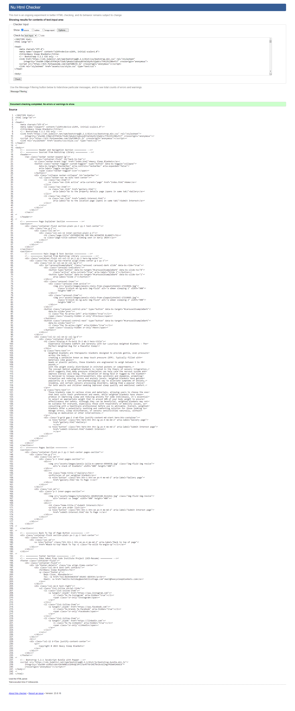
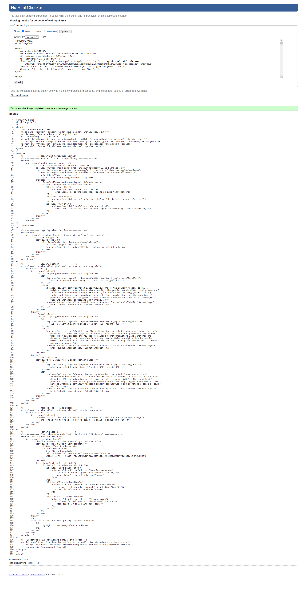
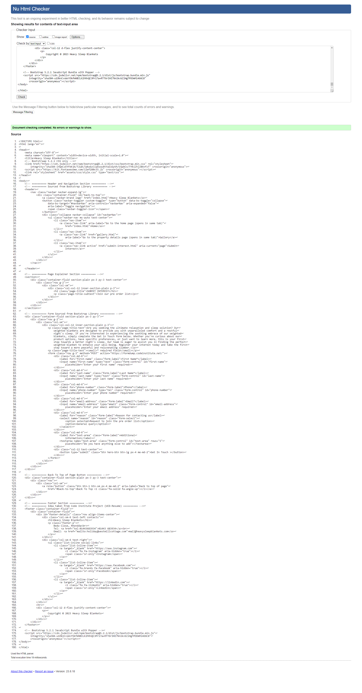
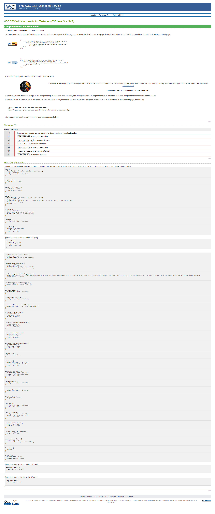
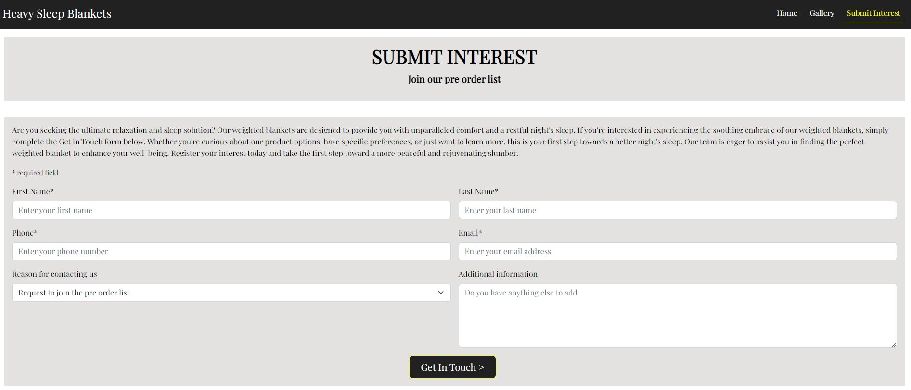
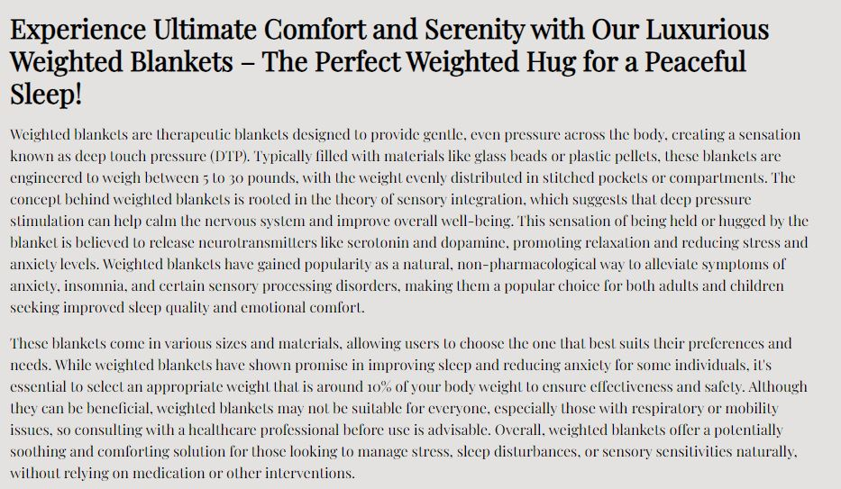

# Testing

The website for Heavy Sleep Blankets has been tested using the following methods:
- [Code Validation](#code-validation)
    - [W3C HTML Validator](#w3c-html-validator)
        - [Home Page](#home-page)
        - [Gallery](#gallery-page)
        - [Submit Interest Page](#submit-interest-page)
    - [W3C CSS Validator](#w3c-css-validator)

- [Browser Compatibility](#browser-compatibility)

- [Responsiveness](#responsiveness)

- [Testing User Stories](#testing-user-stories)
    - [Prospective Customers](#prospective-customers)
    - [Returning Customers](#returning-customers)

- [Bugs](#bugs)
    - [Resolved](#resolved)

# Code Validation

## W3C HTML Validator

Each page of the Heavy Sleep Blankets website was subjected to the W3C HTML Validator tool, the results are evidenced below:

### Home Page
<h2 align="left"></h2> 

### Gallery Page
<h2 align="left"></h2> 

### Submit Interest Page
<h2 align="left"></h2> 

## W3C CSS Validator

The Heavy Sleep Blankets website stylesheet was subjected to the W3C CSS Validator tool, the results are evidenced below:
<h2 align="left"></h2>

# Browser Compatibility

On desktop, the site was tested in the following browsers:
- Chrome
- Edge
- Firefox
- Safari

No issues were identified with appearance, responsiveness or functionality during usage of the website on these browsers.

On mobile and tablet, the site was tested in the following browsers:
- Chrome
- Safari
- Firefox

No issues were identified with appearance, responsiveness or functionality during usage of the website on these browsers.

# Responsiveness

Responsiveness assessments were undertaken using the Chrome Developer Tools across a number of screen sizes including: 
- iPhone SE
- iPhone XR
- iPhone 12 Pro
- Pixel 5
- Samsung Galaxy S8+
- Samsung Galaxy S20 Ultra
- iPad Mini
- iPad Air
- Surface Pro 7
- Surface Duo
- Galaxy Fold
- Samsung Galaxy A51/71
- Nest Hub
- Nest Hub Max

No issues were identified with appearance, responsiveness or functionality during usage of the website on these virtual screen sizes.

# Testing User Stories 

## Prospective Customers 

*The website users that fall into this category are considering purchasing a weighted blanket.*  

* As a user, I want to visit the website and see a visually appealing "Coming Soon" page for weighted blankets, so I can learn more about the upcoming product.

  - The homepage clearly introduces and indicated that the product is due to launch, with details of the product also.  

<h2 align="left"></h2>

* As a user, I want to have the option to join a mailing list to be alerted when the weighted blankets are available for purchase.  
  
  - The customer is able to submit their interest via the name page.

<h2 align="left"></h2>

* As a user, I want to find information about the benefits of weighted blankets and why I should consider buying one, so I can make an informed decision.   
  
  - Each page gives details of the benefits of the weighted blanket.

<h2 align="left"></h2>

## Returning Customers  

*The website users that fall into this category are people that are returning to the website for an update*  

* As a returning user, I want to see if there are any updates or changes to the launch date, so I can plan accordingly.  

  - The customer can return to the homepage for an update or submit their interest using the form to stay up to date.

* As a returning user, I want to easily access the newsletter signup or notification options in case I missed them during my initial visit.

  - The submit interest page is clearly labeled on the navbar and homepage to meet this need.

# Bugs

## Resolved
  - h1 elemets were used in inappropriate locations accross the website, these were changed to h2.
  - section element was usedon gallery and submit interest without a h1 elements, therefore it was removed.
  - form name was highlighted as not needed, therefore removed.  